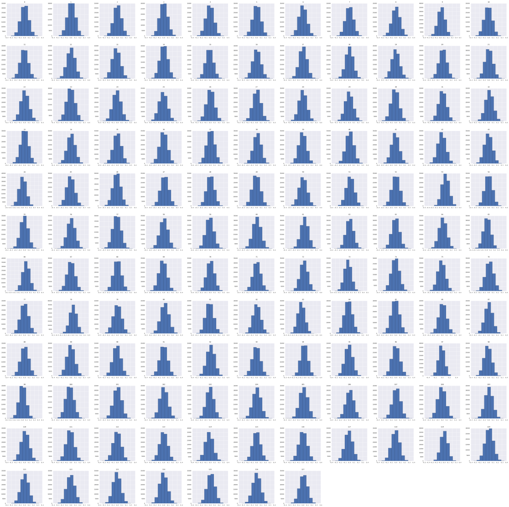
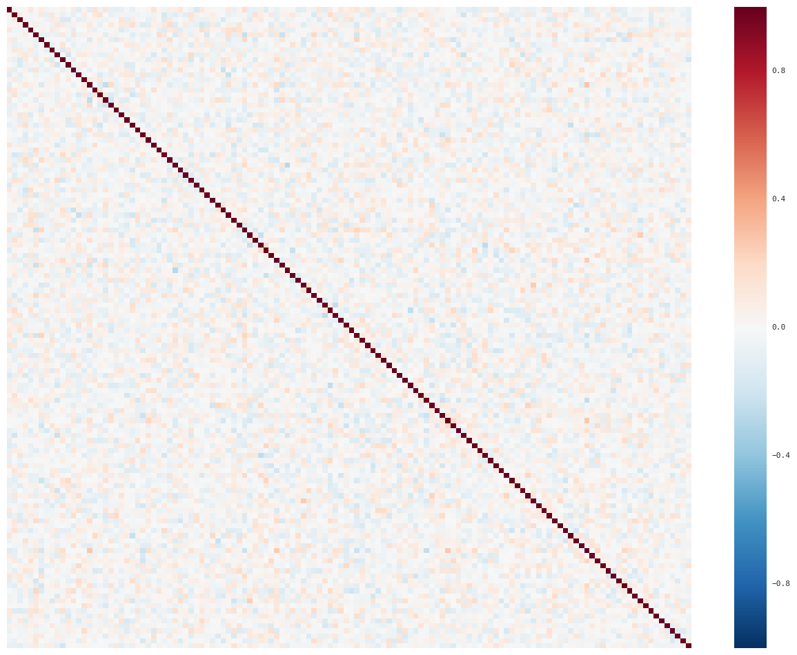

# Report of Machine Learning course's challenge

## First Step : Data Analysis

First, we plot, with seaborn, the correlation matrix of the features. We can see that there isn't any visible correlation between our different features.
We can also see that each of the features follows a normal law and there isn't any visible "flaw" in the data, meaning that there's not so much feature engineering to do in order to fill missing values, filter outliers etc ...
Nevertheless, we do a feature selection using a LogisticRegression estimator and the Recursive Feature Elimination Class.
With this method, we can remove 9 features. 

<figure>

<figcaption align="center">Plots of features' distribution</figcaption>
</figure>
<figure>

<figcaption align="center">Correlation Matrix of the training variables</figcaption>
</figure>

## Second Step Model Selection

We start with a "reference" model which is the one provided in the starter notebook e.g a Logistic Regression.
The score is not so good because we end with a *~0.6385* score on the training set which is very high and means our classifier is **under-fitting** the training set.
Anyway, we obtain a score of *~1.381* which is worst than predicting 0 for each of the observations e.g undefined  
As the improvement in score is not significant without the removed columns, we chose to take to reinclude them into 
the training dataset.
We are told the dataset are variables build from pictures and we know Neural networks are efficient for this type of 
problem. We start with a "base" Multi-layer perceptron from Scikit learn e.g using default values from the python's class.
The fitting score on the training data-set is nearly perfect : *~0.00028* and on the leaderboard we get a *~0.34* score.
Now, to improve the score we check the effect of Standardization over the training dataset. We use the StandardScaler from SKLEARN
and predict over the training dataset. The score decreased, and it's perhaps linked to the fact that the variables are all Standardized
gaussian distribution. 
Anyway, we start with this "base" model and the non-standardized dataset and try to optimize the hyper-parameters.

In order to do that we use the GridSearchCV class and cross-validate the following parameters : 
* max_iter [100, 300, 500, 1000]
* hidden_layer_sizes [2:20]
* activation ['tanh','identity','logistic','relu']
* alpha [0.0001:0.001]
This GridSearch vas computationnally intensive and took about a night. Finally, we get the following parameters :
* max_iter : 300
* hidden_layer_sizes : 14
* alpha : 0.0002

The training score for this model is *~0.14* which significantely worse than the default MLP one's. And without any suprise the score
on the leader bord is not better than the previous one.
We now explore an other way to improve the score on the leaderboard : don't predict any class when we are below or above a treshold
for the probability of the observation to belong to a class.
We can see by plotting the distributions of probabilities of the 2 classes that there are tails near 0% and 100% of probabilities to belong to the class.
So we set the prediction to 0 for the observations which are between two bounds found empirically. The best score obtained this way is
*~0.20*.

 
